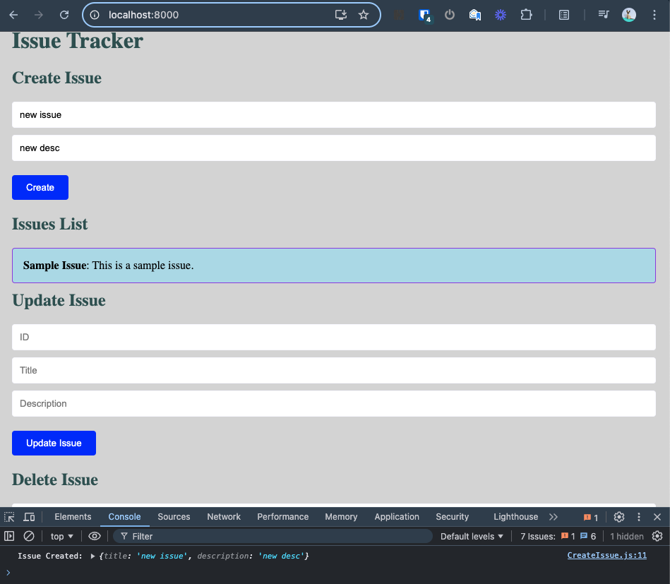

# Sitemate Backend Challenge - Sep 2024

## Overview

This project is a simple REST API server with a client application designed to manage "Issues" (similar to GitHub or Jira). The server and client are developed to demonstrate CRUD operations and are bundled in a streamlined, easy-to-deploy setup.

## Features

- **REST API**: Provides endpoints for creating, reading, updating, and deleting issues.
- **Client Application**: A React front-end interface for interacting with the API, served statically from the Express server.
- **Environment Configuration**: Managed using `.env` files for flexibility across different environments.
- **Modular Design**: Clear separation between client and server components.
- **Basic UI Styling**: Simple and clean UI with unique color names to provide a personalized look and feel.

## Technologies

- **Backend**: Node.js, Express.js
- **Frontend** (Served Statically): React, CSS for styling
- **Environment Management**: dotenv

## Setup and Usage

### 1. Clone the Repository

```
git clone https://github.com/MistakeDefined/SitemateBackendChallenge.git

cd SitemateBackendChallenge
```

### 2. Install Dependencies

### Both Server and Client together

```bash
npm install
```

<!-- #### Server

```
cd server

npm install
``` -->

### 3. Run the Server (local development/dev mode)

Update the .env file or set the environment variable to run the server on a different port if needed (default is 8000):

`npm run start-dev`

- The server will start on `http://localhost:8000`.
- The React client is served statically from the server at the above URL.

### 4. Test the API

Use tools like Postman to interact with the API. The base URL for all API requests is:

`http://localhost:8000/api/v1/`

### Example Endpoints:

- **Create Issue**: `POST /api/v1/issues`
- **Get Issue**: `GET /api/v1/issues`
- **Update Issue**: `PUT /api/v1/issues/:id`
- **Delete Issue**: `DELETE /api/v1/issues/:id`

### Client/Front-end Screenshot

Here’s a screenshot of the client interface:



### 5. Postman Collection

To make testing easier, a Postman collection is provided. You can find it at the following path:

`server/SitemateBackendChallenge-Sep2024.postman_collection.json`

- **Import the Collection**: Import this file into Postman to easily access and run the CRUD operations.

#### Postman Environment Variables

To ensure flexibility and easy configuration, the Postman collection uses environment variables for the server, port, and API version:

1.  **Variables**:

    - **`server`**: The server address where the API is hosted. Default is `localhost`.
    - **`port`**: The port on which the API server is running. Default is `5000`.
    - **`apiVersion`**: The API version. Default is `v1`.

## Future Enhancements

- **Static Frontend**: Serve the client application statically from the backend.
- **Dockerization**: Containerize the entire application for easy deployment.

## License

This project is licensed under the MIT License.
